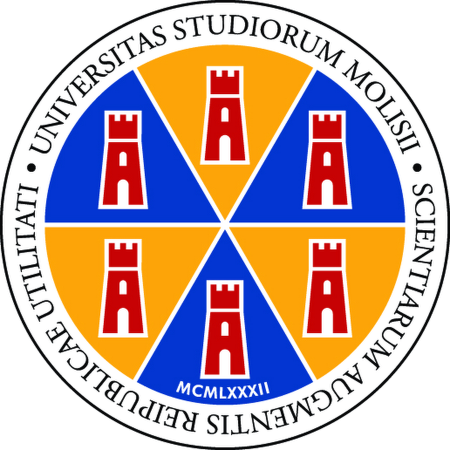

  </img>
  <h1 align="center">A Fine-Grained Analysis of Comments Quality in Code-Related Datasets</h1>

## Abstract
Large Language Models (LLMs) are fundamental to the operation of advanced tools in software development, such as code autocompletion. These models are trained on large datasets to predict and suggest code snippets during programming, helping to improve productivity and reduce errors. However, the quality of their performance strongly depends on the training data, including the comments within the code. Poor-quality, incomplete, or unclear comments can lead to less accurate predictions. This thesis arises from the need to improve the quality of comments in large code datasets, given the increasing use of LLMs in development environments. The main goal is to create a systematic approach to categorize comments and automatically identify those of low quality, thus improving the data used to train these models.
To validate the effectiveness of this approach, an empirical study was conducted on two datasets: CodeSearchNet (CSN) and AUGER. These datasets were chosen for their unique characteristics: CSN contains general-purpose code, while AUGER focuses on code review comments. Natural language processing (NLP) techniques and a set of heuristics were applied to analyze and classify the quality of the comments. The results demonstrated the tool's effectiveness across most of the analyzed comment categories, with an accuracy and precision of 94% and 84% for CSN, and 90% and 86% for AUGER, respectively. However, some categories presented greater challenges, requiring further development. This work underscores the importance of comment quality in datasets to enhance the effectiveness of LLMs and contributes to laying the groundwork for further research aimed at refining the heuristics used and expanding their scope to support a broader range of programming languages.
